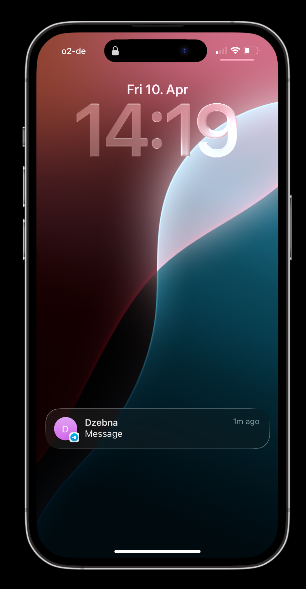
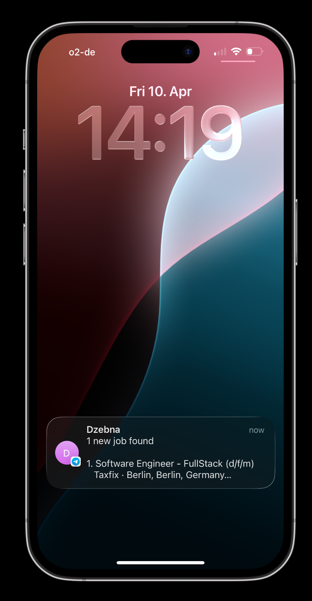

# Dzebna Bot — Job Notifier

Scrapes job boards (LinkedIn, Indeed, Glassdoor) and sends new job offers via Telegram.

## Features

- Telegram bot for user registration and search configuration
- Automated job scraping from multiple job boards
- Automatic notifications to users via Telegram
- Smart filtering: **only jobs posted in the last 24 hours**
- MySQL database to store jobs and user preferences
- FastAPI REST API for job management
- APScheduler for automated scrape cycles
- Real-time deduplication to prevent duplicate notifications

## Tech Stack

- **FastAPI** — REST API framework
- **SQLAlchemy** — ORM for database
- **python-telegram-bot** — Telegram bot framework
- **python-jobspy** — Job scraping library
- **APScheduler** — Job scheduling
- **MySQL** — Data persistence
- **Docker Compose** — Container orchestration

## Setup

### Prerequisites

- Docker & Docker Compose
- Telegram Bot Token (get from [@BotFather](https://t.me/botfather))

### Installation

1. Clone the repository:
```bash
git clone <repo-url>
cd dzebna-bot
```

2. Create `.env` file:
```bash
cp .env.example .env
```

3. Edit `.env` with your Telegram bot token:
```
TELEGRAM_BOT_TOKEN=your_token_here
```

4. Start containers:
```bash
docker compose up --build
```

## Usage

### Start the Telegram Bot

Send `/start` to your bot on Telegram.

### Notification Example

The bot sends clean, formatted job notifications directly to your Telegram:




**Key Features:**
- Fresh jobs only — Only jobs posted within the last 24 hours are sent
- Direct links — Click to view the full job posting on the original board
- Rich details — Company, location, salary range, and job type included
- Push notifications — Receive alerts straight to your phone

### Demo Video

Watch the bot in action—automated scraping and real-time job notifications:

<video width="300" controls>
  <source src="assets/display_message_record.mov" type="video/mp4">
  Your browser does not support the video tag.
</video>

**What the demo shows:**
- User receives instant push notification when new job matches their search
- Job card displays in lock screen with key details (position, company, location)
- Users can tap to open the full job listing directly on the source board
- All jobs shown are within the 24-hour window to ensure relevance

### Manual API Request

```bash
curl -X POST http://localhost:8000/jobs/scrape \
  -H "Content-Type: application/json" \
  -d '{
    "search_term": "python developer",
    "location": "Berlin",
    "site_names": "linkedin,indeed"
  }'
```

### View API Documentation

- **Swagger UI**: http://localhost:8000/docs
- **ReDoc**: http://localhost:8000/redoc

### Database Management

Access MySQL via Adminer: http://localhost:8080

## Configuration

All settings are in `.env`:

| Variable | Purpose | Default |
|----------|---------|---------|
| `TELEGRAM_BOT_TOKEN` | Bot authentication token | required |
| `DATABASE_URL` | MySQL connection string | `mysql+pymysql://...` |
| `DEFAULT_SEARCH_TERM` | Default job search term | `engineer` |
| `DEFAULT_LOCATION` | Default job location | `Berlin, Germany` |
| `DEFAULT_RESULTS_WANTED` | Results per scrape | `20` |
| Age filter: Only jobs posted within the last 24 hours are stored and sent
- Deduplication: Each job is stored once per board to prevent duplicate notifications
- Active configs

The scraper automatically filters jobs:
- **Age filter**: Only jobs posted within the last 24 hours are stored and sent
- **Deduplication**: Each job is stored once per board to prevent duplicate notifications
- **Active configs**: Only active search configs are processed during scheduled runs

## Project Structure

```
dzebna-bot/
├── app/
│   ├── main.py              # FastAPI app entry point
│   ├── config.py            # Settings from .env
│   ├── db.py                # Database connection
│   ├── models.py            # SQLAlchemy ORM models
│   ├── schemas.py           # Pydantic request/response schemas
│   ├── routers/
│   │   └── jobs.py          # Job API endpoints
│   └── services/
│       ├── bot.py           # Telegram bot handlers
│       ├── scraper.py       # JobSpy scraping logic
│       ├── notifier.py      # Send Telegram messages
│       └── scheduler.py     # APScheduler logic
├── docker-compose.yml       # Container orchestration
├── Dockerfile               # App container image
├── requirements.txt         # Python dependencies
├── init.sql                 # Database initialization
└── .env                     # Environment variables
```

## Troubleshooting

### Bot not responding

Check logs:
```bash
docker compose logs jobnotifier_app -f
```

### No jobs found

- Verify search term and location
- Check if job sites are accessible
- View API docs at http://localhost:8000/docs

### Port already in use

```bash
lsof -ti:3306 | xargs kill -9  # MySQL
lsof -ti:8000 | xargs kill -9  # API
```

## License

MIT
EOF